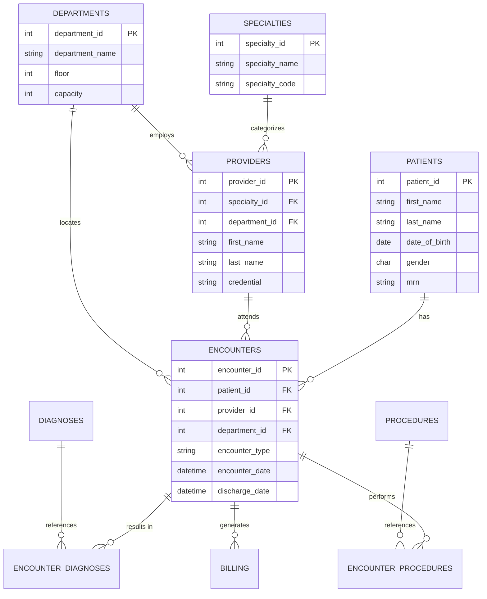
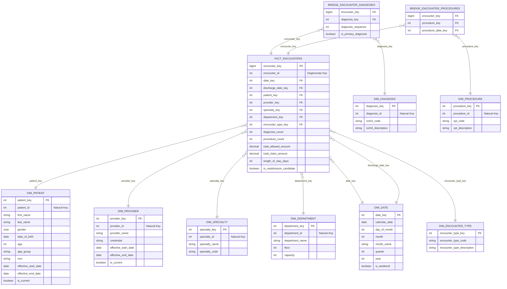

# Healthcare OLAP Project

This project implements a robust healthcare data analytics platform, transitioning clinical data from a transactional OLTP system to an analytical Star Schema (OLAP) with historical tracking capabilities.

## Technical Overview

The system architecture consists of two main database schemas:

1.  **Production (OLTP)**: A normalized schema designed for high-concurrency transactional data entry.
2.  **Star Schema (OLAP)**: A denormalized schema optimized for analytical queries, featuring SCD Type 2 tracking for historical data integrity and a pure star design.

---

## 1. Production Database (OLTP)

The production schema is designed to capture core clinical entities including patients, providers, encounters, billing, diagnoses, and procedures.

### OLTP Entity Relationship Diagram



---

## 2. Analytics Database (OLAP - Star Schema)

The analytics schema has been refactored from a snowflake design to a pure **Star Schema**. All dimension tables connect directly to the central fact table.

### Key Features

- **Pure Star Schema**: Removed all dimension-to-dimension relationships (e.g., `dim_provider` no longer links directly to `dim_specialty`).
- **Slowly Changing Dimension (SCD) Type 2**: History tracking enabled for `dim_patient` and `dim_provider` using effective date ranges and status flags.

### Star Schema Entity Relationship Diagram



---

## Project Structure

- `Part1/gen_data/`: Contains OLTP schema DDL (`Oltp_schema.sql`) and initial data loading scripts (`star_schema_ddl.sql`).
- `Part3_analytics/`: Contains the core OLAP schema definition and refactored ETL logic (`star_schema.sql`).
- `Part4_reflection/`: Project documentation and reflections.

## ELT Process Pseudocode

The ELT (Extract, Load, Transform) logic handles the migration of clinical data into the star schema while maintaining historical integrity.

### 1. Dimension Loading (Type 1)

For static or overwrite dimensions (Date, Specialty, Department, Encounter Type, Diagnosis, Procedure):

```text
BEGIN Dimension Update
    FOR each source record in the Production system:
        LOOKUP the natural ID in the target Dimension table
        IF no match is found:
            CREATE a new record with a unique surrogate key
        ELSE:
            OVERWRITE the existing attributes with the latest production values
    END FOR
END Dimension Update
```

### 2. Dimension Loading (SCD Type 2)

For dimensions with history tracking (Patient, Provider):

```text
BEGIN SCD Type 2 Update
    FOR each source record in the Production system:
        FIND the record version marked as 'Current' in the Dimension table

        IF a 'Current' version exists:
            COMPARE production attributes with dimension attributes
            IF any tracked attribute has changed:
                1. EXPIRE the old version: set its 'End Date' to today and 'is_current' to FALSE
                2. CREATE a new version: set its 'Start Date' to today, 'End Date' to infinity, and 'is_current' to TRUE
        ELSE:
            CREATE the initial version: set its 'Start Date' to today, 'End Date' to infinity, and 'is_current' to TRUE
    END FOR
END SCD Type 2 Update
```

### 3. Fact Table Population

```text
BEGIN Fact Population
    FOR each clinical Encounter in the Production system:
        1. RESOLVE DIMENSION KEYS:
           - Match Patient records where the encounter date falls within the validity range (Start/End Dates)
           - Match Provider records where the encounter date falls within the validity range
           - Lookup Surrogate Keys for Specialty, Department, and Date dimensions

        2. CALCULATE ANALYTICAL METRICS:
           - Sum all related Billing amounts (Claim and Allowed)
           - Count unique Diagnosis and Procedure codes linked to the encounter
           - Determine 'Length of Stay' using admission and discharge dates

        3. UPSERT FACT RECORD:
           - Update the central Fact table with the resolved keys and calculated metrics
    END FOR
END Fact Population
```

---

## Usage

1.  **Initialize Production**: Run `Part1/gen_data/Oltp_schema.sql`.
2.  **Initialize Analytics**: Run `Part3_analytics/star_schema.sql`.
3.  **Execute ETL**: The `star_schema.sql` script contains the full logic to extract data from `production` and load it into `star_schema`, handling SCD Type 2 updates automatically.
